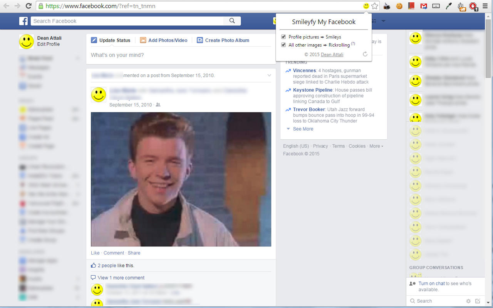

# Smileyfy My Facebook (Chrome extension)

_[Dean Attali](http://deanattali.com)_    
_January 2015_    
_Source code available [on GitHub](https://github.com/daattali/smileyfy-my-facebook-extension)_     
_Get the extension at the [Chrome Web Store](https://chrome.google.com/webstore/detail/smileyfy-my-facebook/ideagdnlnmgjdhhbelgadnakbhphljol)_  

## Installation

Installation is extremely easy: just go to [the Chrome extension store](https://chrome.google.com/webstore/detail/smileyfy-my-facebook/ideagdnlnmgjdhhbelgadnakbhphljol) and click on the "Add to Chrome" button.

## Description

This is a Chrome extension that adds infinite happiness to your Facebook browsing, plus a little bonus rickrolling :)  

Smileyfy My Facebook will convert all profile pictures on Facebook to smileys, which makes for a very fun Facebooking experience.  All other images that are not profile pictures will be converted to a picture of Rick Astley ([Rickrolling](http://en.wikipedia.org/wiki/Rickrolling) for those who missed out on a full year of internet).

If you're in need of some more smiles in your life, or you constantly find yourself thinking "gee, I really don't get my daily dose of Rick Astley", then this extension is for you!

## Features

- Smileyfy My Facebook is non-intrusive and will only show up when browing Facebook.
- Smileyfy My Facebook will not take up any resources or show up in Chrome's Task Manager when you don't have a Facebook tab open.
- The conversion of profile pictures to smileys and of other pictures to Rick Astley are both configurable options that can be turned on/off independently of each other.  
- The options can be acceessed either by clicking on the extension icon or through the Options page under `chrome://extensions`.  
- The options are saved and remembered indefinitely, so if you ever get sick of smileys you can simply disable them temporarily instead of uninstalling the extension.  
- The extension works on any page in Facebook (home/messages/profile/etc).  
- The extension is AJAX-aware, and will convert new images that get rendered as you scroll down.
- There are a few different Rick images, each with a different aspect ratio, so that each Facebook image can be replaced with an image with a similar aspect ratio.  This is to prevent over-stretching of images which looks really bad.
- A "refresh" button in the extension will let you see how the page looks with and without smileyfication with ease.

## Screenshot

## My other extensions

[GitHub Diff Navigator](https://github.com/daattali/github-diff-navigator-extension) - Chrome extension that allows you to easily navigate through the changes in a file that has been edited on GitHub

[Google Slides Auto Resize Speaker Notes](https://github.com/daattali/gslides-betternotes-extension) - the slides thumbnails in the Speaker Notes window of Google Slides are tiny. This extension dynamically resizes the slides to be more readable based on the window size.

[Project Free TV Ad Bypass](https://github.com/daattali/pftv-ad-bypass-extension) - Project Free TV serves a 10-second ad page before allowing users to continue to the video - this extension bypasses the ad page.

---

To see my other projects, visit [http://deanattali.com/projects](http://deanattali.com/projects)

## Disclaimer

I would not advise using my code as a template or resource for learning how to write Chrome extensions. I learned how to write the extension and fully built it fairly quickly, so I'm not sure what the best practices are and how to properly organize the code. It was just an excuse to test out how Chrome extensions work. I also left a little bit of ugly code in there -- please dont judge :)

